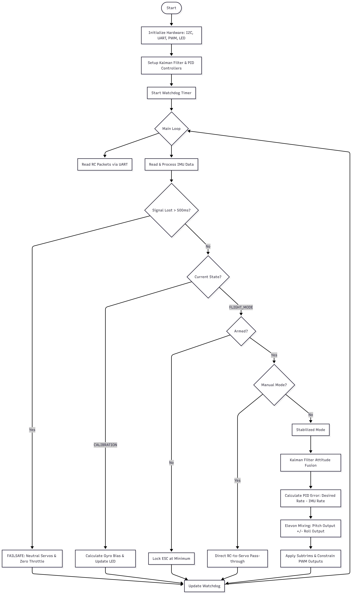

# **WingFC Flight Control Logic (v0.3.0)**

## **Overview**

The WingFC firmware utilizes a 200Hz (5ms) control loop to manage flight stabilization for sub-250g fixed-wing aircraft. It integrates sensor fusion via a Kalman filter and utilizes PID controllers for pitch and roll stabilization. Kalman filters and Matrix operations are ready for 3 state stabilization.

## **System Flowchart**

The following logic represents the core operational flow of the main.go entry point.

## **Logic Breakdown**

### **1\. Initialization & Safety**

* **Hardware Setup:** Configures the Seeed Studio Xiao nRF52840 Sense pins for I2C (LSM6DS3TR-C IMU/Magnetometer), UART (IBUS/CRSF/ELRS), UART2 (GPS), and PWM (Servos/ESC).  
* **Watchdog:** A 1-second hardware watchdog triggers a system reset if the main loop hangs.

### **2\. State Machine**

* **CALIBRATION:** Finds gyro bias while stationary to prevent PID "drift." A magnetometer is highly recommended for yaw stabilization.   
* **FAILSAFE:** Centers surfaces and cuts power if connection is lost for \>500ms.  
* **FLIGHT\_MODE:** Monitors arming status and toggles between stabilized and manual control.

### **3\. Stabilized Control Loop (200Hz)**

* **Sensor Fusion:** Kalman filter fuses accelerometer and gyroscope data for a stable attitude estimate.  
* **PID Control:** Maps RC stick positions to a "Desired Rate" and calculates the error against the "Actual Rate" from the IMU.  
* **Elevon Mixing:** Mixes pitch and roll outputs to drive left and right elevons.
* **Airframe Mixing:** Will add ApplyMixer() function to calculate proper mixing for various airframes.